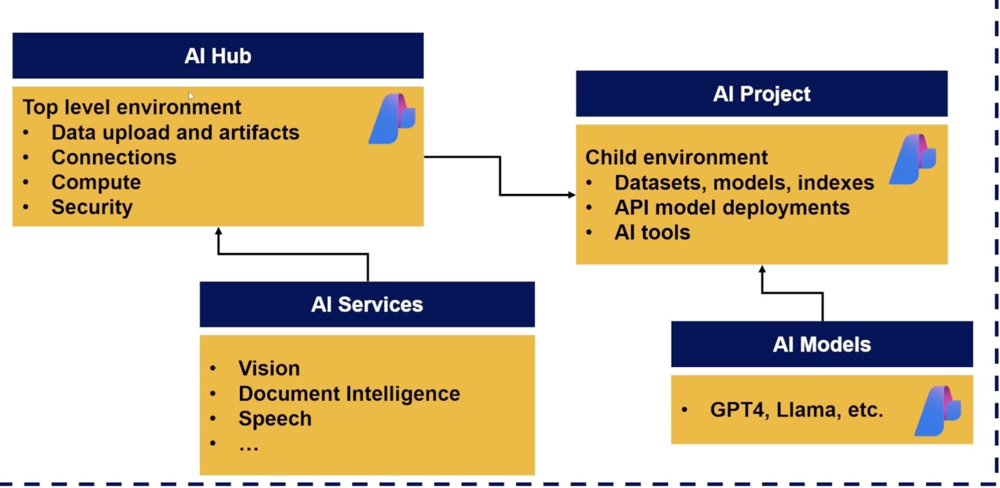

### **Azure AI Studio Architecture: Deep Dive with Technical Insights & Real-World Examples**

_(For Interviews, Technical Understanding, and AI Development)_

#### **Core Architectural Components**



Azure AI Studio's architecture is designed for **scalability**, **collaboration**, and **enterprise-grade security**. Here's the breakdown:

1.  **AI Hub**

    - **What**: The top-level container for all AI resources.

    - **Key Features**:

      - **Centralized Management**: Manages shared resources (security, compute, data connections).

      - **Security**: Role-based access control (RBAC) for teams.

      - **Integration**: Connects to Azure services (Storage Accounts, Key Vault, Virtual Networks).

    - **Example**: A healthcare company creates an AI Hub to centralize all patient data analysis projects.

2.  **AI Projects**

    - **What**: Child environments under an AI Hub for specific use cases.

    - **Key Features**:

      - **Isolation**: Each project has its own datasets, models, and indexes.

      - **Collaboration**: Invite team members to work on models, prompt flows, or deployments.

      - **Resource Sharing**: Uses the AI Hub's compute and security but maintains project-specific data.

    - **Example**:

      - Project 1: A chatbot for patient FAQs (using GPT-4).

      - Project 2: Medical image analysis (using Vision models).

3.  **AI Models**

    - **What**: Deployable LLMs or custom models within a project.

    - **Key Types**:

      - **Foundation Models**: Pre-trained models (GPT-4, Llama-3, Mistral).

      - **Fine-Tuned Models**: Custom-trained models (e.g., a finance-specific LLM).

    - **Deployment Options**:

      - **Serverless**: Pay-per-use (ideal for prototyping).

      - **Provisioned Compute**: Dedicated VMs (for high-throughput production workloads).

    - **Example**: Deploying a serverless GPT-4 model to answer customer queries in real-time.

4.  **AI Services**

    - **What**: Azure's pre-built AI capabilities (vision, speech, document intelligence).

    - **Integration**: Use standalone or combine with LLMs in workflows.

    - **Example**:

      - **Document Intelligence**: Extract data from invoices.

      - **Speech Service**: Transcribe call center recordings.

---

#### **Technical Deep Dive: Key Concepts**

1.  **Data Connections**

    - **How It Works**: Link datasets from Azure Storage, SQL DB, or OneLake.

    - **Use Case**: Connect a SQL table of customer orders to build a sales forecasting app.

2.  **Vector Indexes**

    - **Purpose**: Enable semantic search over large datasets (e.g., internal documents).

    - **Workflow**:

      1.  Chunk documents into embeddings.

      2.  Store in a vector index (e.g., Azure AI Search).

      3.  Use LLMs to query the index.

    - **Example**: A legal firm indexes case files for quick retrieval via a chatbot.

3.  **Prompt Flow**

    - **What**: A low-code tool to chain models, data, and APIs.

    - **Components**:

      - **Nodes**: LLMs, Python scripts, API calls.

      - **Connections**: Data inputs/outputs.

    - **Example Flow**:

    ```yaml
    User Input → GPT-4 (Generate SQL Query) → Execute Query → Return Results
    ```

4.  **Security & Compliance**

    - **Key Features**:

      - **Private Endpoints**: Isolate resources in a VNet.

      - **Data Encryption**: At rest (Azure Storage) and in transit (TLS 1.2+).

      - **Audit Logs**: Track model usage and data access.

---

#### **Cost Management: Avoiding Azure Bill Shock**

1.  **Serverless vs. Provisioned Compute**

    - **Serverless**:

      - **Cost**: Pay per token (e.g., $0.002/1k tokens for GPT-4).

      - **Use Case**: Prototyping, low-traffic apps.

    - **Provisioned**:

      - **Cost**: Fixed hourly rate (e.g., $3/hr for a VM).

      - **Use Case**: High-volume, latency-sensitive apps.

2.  **Real-Life Cost Example**

    - **Scenario**: A customer support chatbot processes 10,000 queries/month.

      - **Serverless GPT-4**: ~20/month(10kqueries×20/month(10kqueries×0.002/1k tokens).

      - **Provisioned VM**: ~2,160/month(30days×24hrs×2,160/month(30days×24hrs×3/hr).

3.  **Best Practices**

    - **Budget Alerts**: Set up in Azure Cost Management.

    - **Cleanup Scripts**: Use Azure CLI to auto-delete unused resources.

    - **Tagging**: Label resources (e.g., "dev," "prod") for cost tracking.

---

#### **Real-World Use Cases**

1.  **Healthcare: Patient Triage System**

    - **Architecture**:

      - **AI Hub**: Centralizes HIPAA-compliant data.

      - **Project**: Combines GPT-4 (symptom analysis) + Vision (X-ray scans).

      - **Deployment**: Serverless API integrated into hospital EHR systems.

2.  **Retail: Personalized Marketing**

    - **Workflow**:

      1.  **Data**: Customer purchase history (Azure SQL DB).

      2.  **Model**: Fine-tuned Llama-3 for product recommendations.

      3.  **Integration**: Deployed as a Power Automate flow to trigger email campaigns.

3.  **Finance: Fraud Detection**

    - **Pipeline**:

      - **Step 1**: Document Intelligence extracts transaction data.

      - **Step 2**: Custom LLM flags anomalies.

      - **Step 3**: Alerts sent via Teams using Azure Logic Apps.

---

#### **Interview Prep: Key Questions**

1.  **Q**: *How does Azure AI Studio handle model versioning?*

    - **A**: Projects track model versions via Azure ML Model Registry. You can roll back to previous versions.

2.  **Q**: *What's the difference between a vector index and a traditional database?*

    - **A**: Vector indexes store embeddings for semantic search, while traditional databases use exact-match queries.

3.  **Q**: *How would you optimize costs for a high-traffic LLM app?*

    - **A**: Use provisioned compute for base load + serverless for spikes. Cache frequent queries with Redis.

4.  **Q**: *Explain how Prompt Flow integrates with external APIs.*

    - **A**: Add an HTTP node in Prompt Flow to call REST APIs (e.g., CRM data fetch).

---

#### **Actionable Tips for AI Developers**

1.  **Leverage Azure ML Integration**: Train custom models in Azure ML and deploy them to AI Studio.

2.  **Use Managed Identities**: Securely authenticate to Azure resources without hardcoding keys.

3.  **Experiment with Multi-Modal Flows**: Combine vision + text models (e.g., analyze social media images + generate captions).

---

**Final Thought**:\
Azure AI Studio's strength lies in its **flexibility**---whether you're building a simple chatbot or a complex, multi-model workflow. Mastering its architecture and cost model will make you a **versatile AI developer** capable of delivering enterprise-grade solutions.
