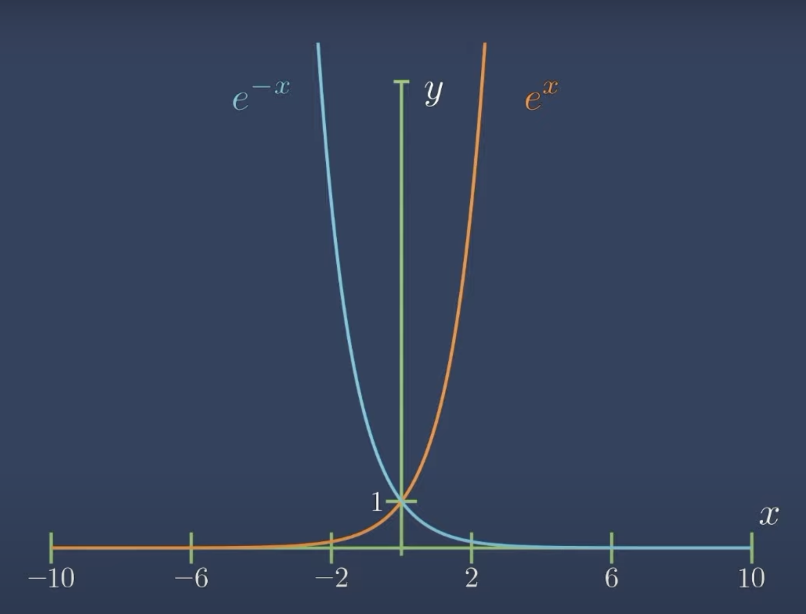
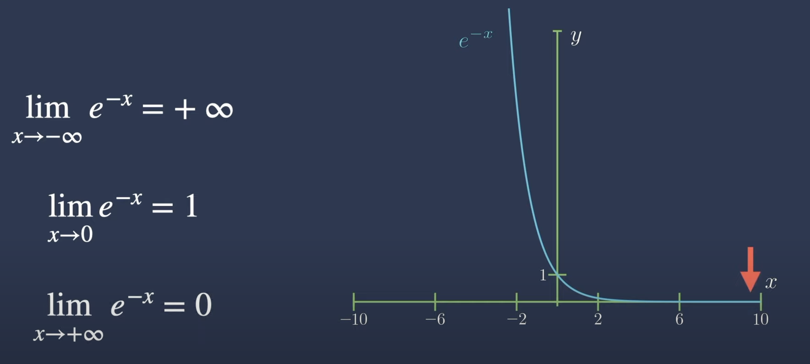
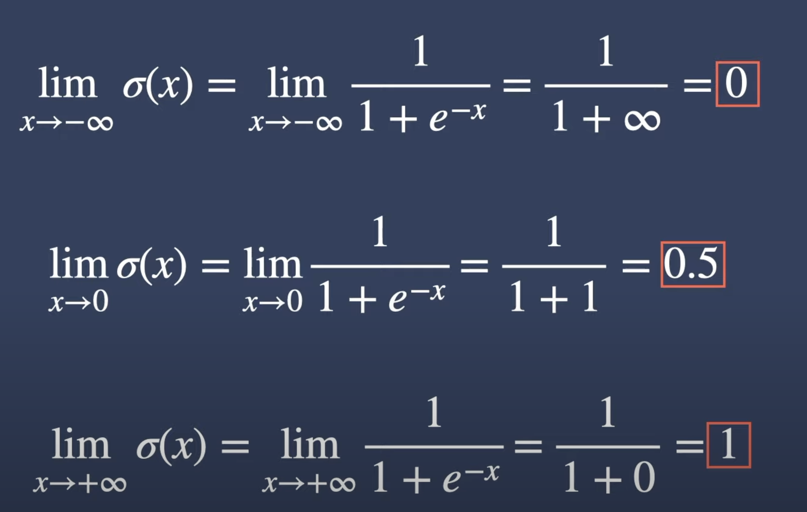
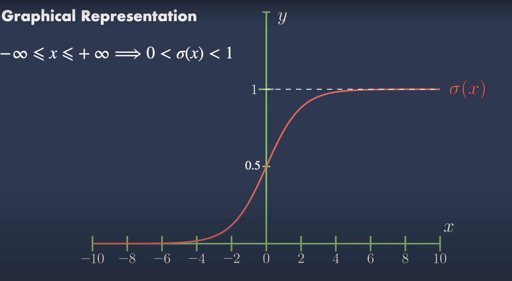
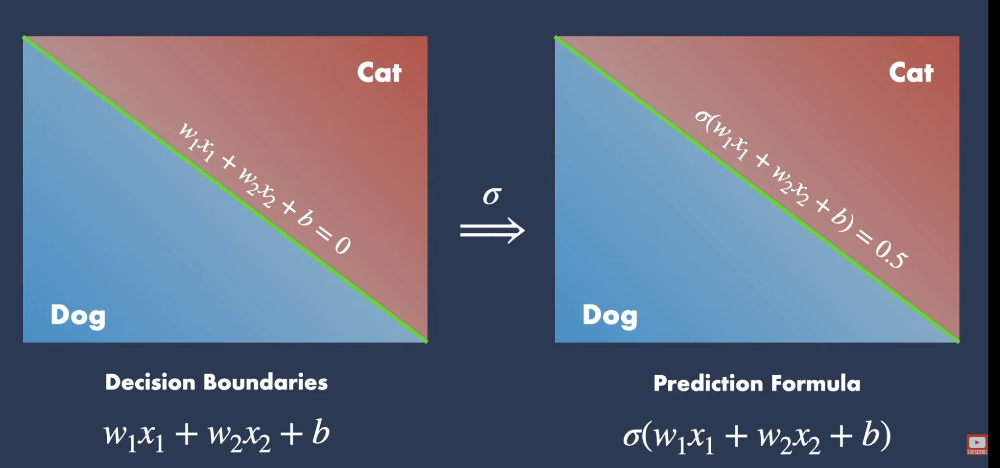
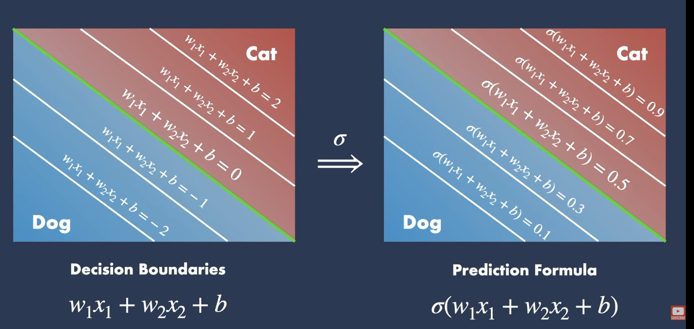
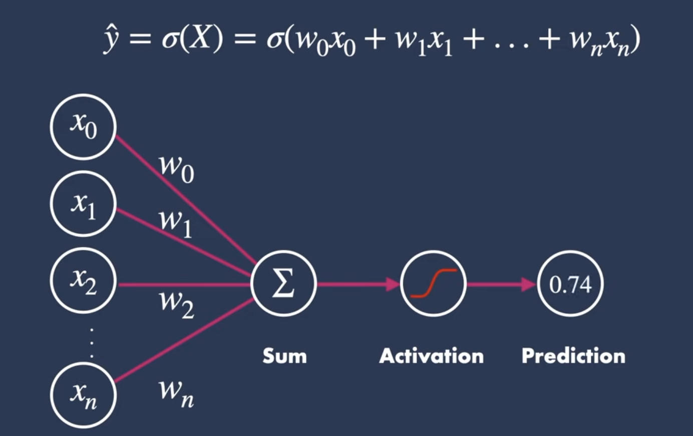

Reference: https://www.youtube.com/watch?v=TPqr8t919YM

## Graph for e power (x) and 1 / e power (x)

## Limit of the Exponential

## Limits of Sigmoid

## Graphical Representation of Sigmoid Function

## Sigmoid Function Use Case

# **Detailed Explanation: Binary Classification (Dog vs. Cat)**

---

## **1\. What Are "Clusters"?**

- **Definition**: Clusters are groups of data points that share similar characteristics.

- **Example**:

  - In a **Dog vs. Cat classification problem**, assume each image is represented by two features:

    - **x₁**: Ear shape (e.g., pointed for dogs, rounded for cats).

    - **x₂**: Whisker length (e.g., shorter for dogs, longer for cats).

  - When plotted on a 2D graph, dog images form one cluster (group) and cat images form another.

  - **Visualization**:

    - **Dog Cluster**: Points concentrated where x1x1​ (ear shape) is high and x2x2​ (whisker length) is low.

    - **Cat Cluster**: Points concentrated where x1x1​ is low and x2x2​ is high.

---

## **2\. Decision Boundary & Graph Explanation**

### **The Decision Boundary Formula**

w1x1+w2x2+b=0w1​x1​+w2​x2​+b=0

- **Purpose**: A straight line that separates the two clusters (dogs vs. cats).

- **Components**:

  - **w1,w2w1​,w2​**: Weights determining the line's slope.

  - **bb**: Bias term shifting the line away from the origin.

### **Graph Details**

- **Quadrant 1**: The graph is in the first quadrant (x1>0,x2>0x1​>0,x2​>0) because features like ear shape and whisker length cannot be negative.

- **Example**:

  - If w1=2w1​=2, w2=-1w2​=-1, and b=-3b=-3, the decision boundary becomes:

    2x1-x2-3=0orx2=2x1-32x1​-x2​-3=0orx2​=2x1​-3

  - **Above the line**: 2x1-x2-3>02x1​-x2​-3>0 → Predicted as **Dog**.

  - **Below the line**: 2x1-x2-3<02x1​-x2​-3<0 → Predicted as **Cat**.

---

## **3\. Sigmoid Function: Probability Calculation**

### **Prediction Formula**

σ(z)=11+e-z,where z=w1x1+w2x2+bσ(z)=1+e-z1​,where z=w1​x1​+w2​x2​+b

- **Purpose**: Converts the linear output (zz) into a probability between 0 and 1.

- **Interpretation**:

  - σ(z)>0.5σ(z)>0.5: Classified as **Dog**.

  - σ(z)<0.5σ(z)<0.5: Classified as **Cat**.

  - **On the decision boundary (z=0z=0)**:

### **Why Sigmoid?**

1.  **Smooth Gradient**: Differentiable, making it ideal for optimization (e.g., gradient descent).

2.  **Probabilistic Output**: Directly interpretable as confidence in prediction.

### **Example**

- **Case 1**: For a data point with z=2z=2:

- **Case 2**: For a data point with z=-1z=-1:

---

## **4\. Summary**

- **Clusters**: Dog and cat data points form distinct groups based on features.

- **Decision Boundary**: A straight line separating clusters, defined by weights (w1,w2w1​,w2​) and bias (bb).

- **Sigmoid Function**: Maps the linear combination (zz) to probabilities.

  - **At z=0z=0**: 50% uncertainty (on the boundary).

  - **Key Use**: Enables probabilistic predictions for classification.
