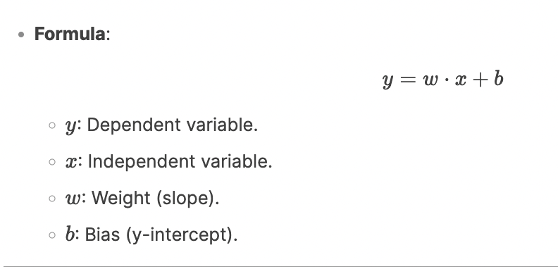
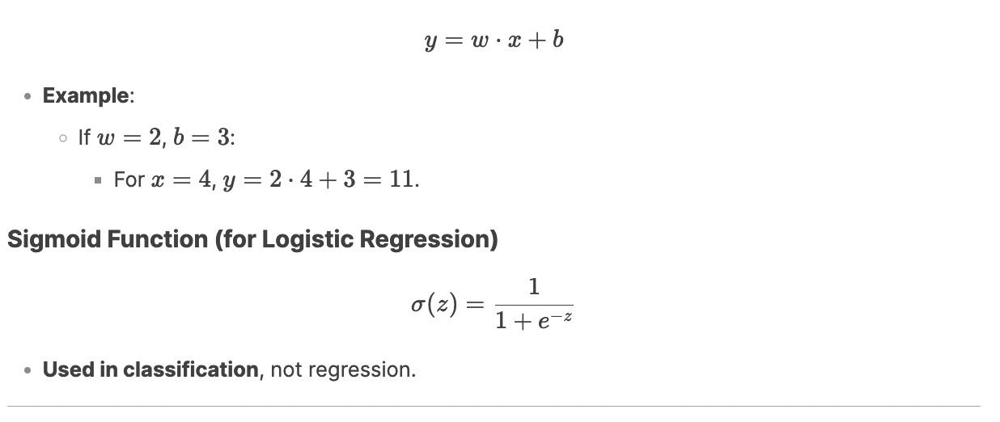

# **Comprehensive Learning Note: Supervised Machine Learning - Regression**

---

## **1\. What is Regression?**

**Simple Definition**: Regression predicts a **continuous numerical value** (like temperature, price, or sales) based on input variables.

- **Example**:

  - Predicting house prices based on size.

  - Forecasting stock prices using historical data.

---

## **2\. Key Components**

### **A. Variables**

1.  **Independent Variable (Input)**:

    - The feature you use to make predictions (e.g., house size, car mileage).

    - Plotted on the **x-axis**.

2.  **Dependent Variable (Output)**:

    - The value you predict (e.g., house price, car price).

    - Plotted on the **y-axis**.

### **B. Relationship**

- **Formula**:

## **3\. Types of Regression**

### **A. Linear Regression**

- **What it does**: Predicts a value using **one independent variable**.

- **Example**:

  - **House Price Prediction**:

    - Input: Size (sq. ft).

    - Output: Price ($).

    - **Equation**: Price=w⋅Size+bPrice=w⋅Size+b.

### **B. Multiple Regression**

- **What it does**: Predicts a value using **two or more independent variables**.

- **Example**:

  - **Car Price Prediction**:

    - Inputs: Age, mileage, engine size.

    - Output: Price ($).

    - **Equation**: Price=w1⋅Age+w2⋅Mileage+w3⋅Engine Size+bPrice=w1​⋅Age+w2​⋅Mileage+w3​⋅Engine Size+b.

---

## **4\. Line of Regression**

- **Definition**: The best-fit line through data points that minimizes prediction errors.

- **Purpose**: Predict yy for any given xx.

- **Example**:

  - If Price=200⋅Size+50,000Price=200⋅Size+50,000:

    - A 1,000 sq. ft house costs 200×1000+50,000=$250,000200×1000+50,000=$250,000.

---

## **5\. Overfitting vs. Underfitting**

| **Overfitting**                                                                                         | **Underfitting**                                                 |
| ------------------------------------------------------------------------------------------------------- | ---------------------------------------------------------------- |
| Model memorizes training data (fails on new data).                                                      | Model is too simple (fails on both training and new data).       |
| **Example**: A complex model predicts stock prices perfectly for past data but fails for future trends. | **Example**: A straight line trying to fit curved data.          |
| **Fix**: Simplify the model or use more data.                                                           | **Fix**: Use a more complex model (e.g., polynomial regression). |

---

## **6\. Real-World Applications**

1.  **Finance**:

    - Predict stock prices using historical trends.

2.  **Healthcare**:

    - Estimate patient recovery time based on age, treatment, and vitals.

3.  **Retail**:

    - Forecast sales using marketing spend and seasonality.

---

## **7\. Regression vs. Classification**

| **Regression**                                             | **Classification**                                       |
| ---------------------------------------------------------- | -------------------------------------------------------- |
| Predicts **continuous values** (e.g., temperature, price). | Predicts **categories** (e.g., hot/cold, spam/not spam). |
| **Example**: What will the temperature be tomorrow?        | **Example**: Will it be hot or cold tomorrow?            |

---

## **8\. Key Formulas & Examples**

### **Linear Regression Equation**

## **Interview Prep: Common Questions**

1.  **Q**: Why is bias (bb) important in regression?

    - **A**: It shifts the line to better fit the data (e.g., a base price for houses).

2.  **Q**: How do you evaluate regression models?

    - **A**: Use metrics like **Mean Squared Error (MSE)** or **R-squared**.

3.  **Q**: What's the difference between linear and polynomial regression?

    - **A**: Polynomial regression uses x2,x3x2,x3 terms to fit curved data.
