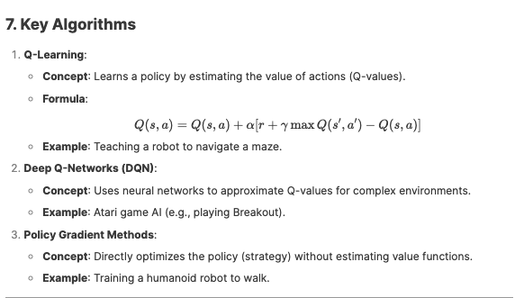

# **Comprehensive Guide to Reinforcement Learning (RL)**

---

## **1\. What is Reinforcement Learning?**

**Definition**: A type of machine learning where an **agent** learns to make decisions by interacting with an **environment**, receiving **rewards** or **penalties** based on its actions. The goal is to maximize cumulative rewards over time.

### **Key Components**:

1.  **Agent**: The learner/decision-maker (e.g., a self-driving car, chess-playing AI).

2.  **Environment**: The world the agent interacts with (e.g., a chessboard, a road).

3.  **State**: The current situation of the environment (e.g., positions of chess pieces, traffic conditions).

4.  **Action**: Choices the agent can make (e.g., moving a pawn, accelerating a car).

5.  **Reward/Penalty**: Feedback from the environment (e.g., +1 for winning a game, -10 for crashing).

6.  **Policy**: The strategy the agent uses to choose actions (e.g., "Always prioritize safety in driving").

7.  **Value Function**: Estimates long-term rewards of states or actions (e.g., "This move leads to a 70% chance of winning").

---

## **2\. How Reinforcement Learning Works**

### **Step-by-Step Process**:

1.  **Agent Observes State**: The environment provides the current state (e.g., a robot senses obstacles).

2.  **Agent Takes Action**: Based on its policy, the agent chooses an action (e.g., turns left).

3.  **Environment Responds**: The environment transitions to a new state and gives a reward/penalty.

4.  **Agent Updates Policy**: The agent adjusts its strategy to maximize future rewards.

### **Example**: Training a Dog with Treats

- **Agent**: Dog.

- **Environment**: Living room.

- **Action**: Sitting, barking, fetching.

- **Reward**: Treat for sitting.

- **Penalty**: Ignored for barking.

- **Outcome**: The dog learns to sit more often to maximize treats.

---

## **3\. Real-Life Examples**

### **A. Autonomous Vehicles**

- **Agent**: Self-driving car.

- **Environment**: Roads, traffic, pedestrians.

- **Actions**: Accelerate, brake, steer.

- **Rewards**: +100 for safe navigation, -1000 for collisions.

- **Outcome**: The car learns optimal driving strategies through trial and error.

### **B. Game AI (e.g., AlphaGo)**

- **Agent**: AI player.

- **Environment**: Go board.

- **Actions**: Placing stones.

- **Rewards**: +1 for a win, -1 for a loss.

- **Outcome**: AlphaGo mastered Go by playing millions of games against itself.

### **C. Robotics**

- **Agent**: Robotic arm.

- **Environment**: Factory assembly line.

- **Actions**: Gripping, rotating, placing parts.

- **Rewards**: +10 for correct assembly, -5 for dropping a part.

- **Outcome**: The arm learns efficient assembly techniques.

### **D. Dynamic Pricing**

- **Agent**: Pricing algorithm.

- **Environment**: E-commerce platform.

- **Actions**: Adjusting product prices.

- **Rewards**: +forincreasedsales,-forincreasedsales,- for lost customers.

- **Outcome**: The system optimizes prices to maximize profit.

---

## **4\. Exploration vs. Exploitation**

- **Exploration**: Trying new actions to discover their effects (e.g., a robot testing a new path).

- **Exploitation**: Using known actions that yield high rewards (e.g., sticking to a proven strategy).

- **Balance**: Use strategies like **ε-greedy** (e.g., 90% exploitation, 10% exploration).

---

## **5\. Challenges in Reinforcement Learning**

1.  **Reward Design**: Poorly defined rewards can lead to unintended behaviors (e.g., a robot flipping over to maximize movement rewards).

2.  **Sparse Rewards**: Rare feedback makes learning slow (e.g., a Mars rover only gets a reward after finding water).

3.  **Computational Cost**: Training requires massive data and resources (e.g., AlphaGo used 1,920 CPUs and 280 GPUs).

## **6\. Differences: RL vs. Supervised vs. Unsupervised Learning**

| **Aspect**   | **Supervised Learning**              | **Unsupervised Learning** | **Reinforcement Learning**    |
| ------------ | ------------------------------------ | ------------------------- | ----------------------------- |
| **Data**     | Labeled (input-output pairs)         | Unlabeled                 | No labels; learns via rewards |
| **Goal**     | Predict outputs                      | Find patterns             | Maximize cumulative rewards   |
| **Feedback** | Immediate (correct answers provided) | None                      | Delayed (rewards/penalties)   |
| **Example**  | Spam detection                       | Customer segmentation     | Autonomous driving            |

---

## **8\. When to Use Reinforcement Learning**

- **Sequential Decision-Making**: Actions affect future states (e.g., chess moves).

- **Dynamic Environments**: Conditions change over time (e.g., stock trading).

- **No Predefined Dataset**: Learn through interaction (e.g., robotics).

---

**Final Takeaway**: Reinforcement learning powers systems that learn from experience, balancing exploration and exploitation to achieve long-term goals. It's ideal for complex, dynamic problems where traditional methods fall short.
