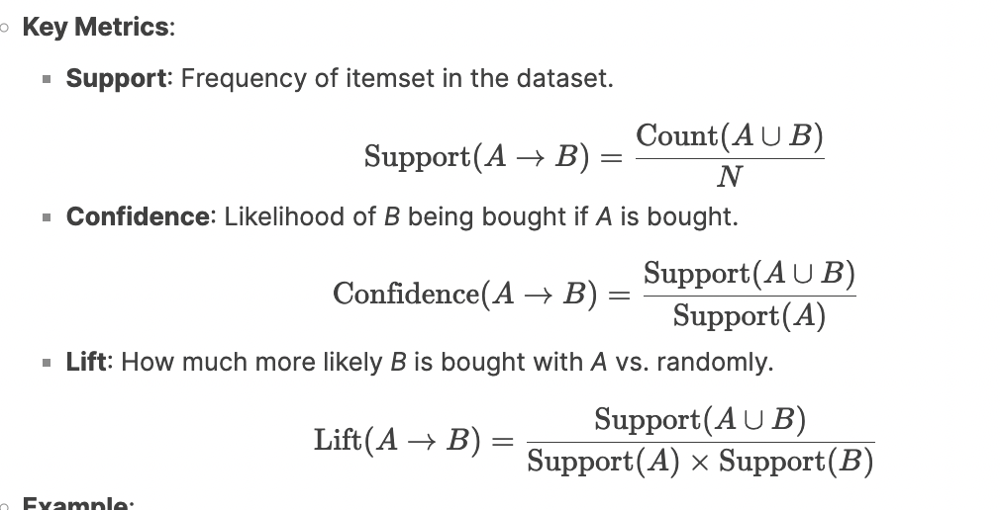

# **Comprehensive Guide to Unsupervised Machine Learning: Clustering & Association**

---

## **1\. What is Unsupervised Learning?**

**Definition**: A type of machine learning where algorithms analyze **unlabeled data** to discover hidden patterns, groupings, or relationships without predefined outputs.\
**Key Idea**:

- **No Supervision**: Unlike supervised learning, there's no "teacher" (labels) to guide the model.

- **Goal**: Explore data structure (e.g., group similar data points, find item associations, detect outliers).

---

## **2\. Types of Unsupervised Learning**

### **A. Clustering**

**Definition**: Grouping data points into clusters where items in the same cluster are more similar to each other than to those in other clusters.

#### **Algorithms**:

1.  **K-Means**:

    - **Steps**:

      1.  Choose *K* (number of clusters).

      2.  Randomly initialize *K* centroids.

      3.  Assign each data point to the nearest centroid.

      4.  Recalculate centroids as the mean of assigned points.

      5.  Repeat until centroids stabilize.

    - **Example**: Grouping mall customers into 3 clusters based on spending habits (e.g., high spenders, bargain hunters, occasional shoppers).

2.  **Hierarchical Clustering**:

    - **Steps**: Build a tree of clusters (dendrogram) by merging or splitting clusters based on distance metrics.

    - **Example**: Organizing genes into hierarchical groups based on expression patterns.

3.  **DBSCAN**:

    - **Steps**: Identify dense regions of data points separated by low-density areas.

    - **Example**: Detecting fraud transactions as outliers in sparse regions.

#### **Evaluation Metrics**:

- **Elbow Method**: Plot the sum of squared distances vs. *K*; choose *K* where the curve bends.

- **Silhouette Score**: Measures how similar a point is to its cluster vs. others (range: -1 to 1).

### **B. Association**

**Definition**: Identifying rules that describe relationships between items frequently occurring together.

#### **Algorithms**:

1.  **Apriori Algorithm**:

    - **Steps**:

      1.  Identify frequent itemsets (items occurring together above a threshold).

      2.  Generate association rules (e.g., *{bread} → {butter}*).

1.  - **Example**:

      - **Udemy Course Bundles**: If 70% of learners buy Course A and B together (support = 0.7), and 90% of those who buy A also buy B (confidence = 0.9), the rule *A → B* is strong.

---

### **C. Anomaly Detection**

**Definition**: Identifying rare events or outliers that deviate from the majority of data.

#### **Techniques**:

1.  **Clustering-Based**: Points far from cluster centroids are anomalies.

    - **Example**: Credit card transactions in low-density clusters flagged as fraud.

2.  **Statistical Methods**: Use Z-scores to detect deviations from the mean.

3.  **Isolation Forest**: Isolates anomalies by randomly partitioning data.

---

## **3\. Real-World Examples**

### **Clustering**:

- **Customer Segmentation**: A retail chain groups shoppers into clusters (e.g., "budget shoppers," "luxury buyers") to tailor marketing campaigns.

- **Image Segmentation**: Grouping pixels in medical images to identify tumor regions.

### **Association**:

- **Market Basket Analysis**: Walmart found that **diapers and beer** are often bought together on Fridays, leading to strategic product placement.

- **Netflix Recommendations**: Users who watch *Stranger Things* often watch *Dark* (association rule).

### **Anomaly Detection**:

- **Healthcare**: Detecting irregular heartbeats in ECG data.

- **Cybersecurity**: Flagging unusual network traffic (e.g., sudden data downloads).

---

## **4\. Applications**

1.  **Recommender Systems**:

    - **Clustering**: Group users with similar preferences (e.g., Spotify's "Discover Weekly").

    - **Association**: Suggest products frequently bought together (e.g., Amazon's "Frequently Bought Together").

2.  **Fraud Detection**: Identifying unusual transaction patterns in banking.

3.  **Genomics**: Clustering genes with similar functions.

---

## **5\. Challenges**

1.  **Determining Cluster Count**: No predefined *K* (solved with elbow method or domain knowledge).

2.  **High Dimensionality**: Clustering becomes harder with many features (use PCA for dimensionality reduction).

3.  **Subjectivity**: Without labels, evaluating clusters requires human judgment.

4.  **Scalability**: Algorithms like Apriori struggle with large datasets.

---

## **6\. Key Takeaways**

- **Clustering** groups similar data (e.g., customer segments).

- **Association** finds item relationships (e.g., product bundles).

- **Anomaly Detection** spots outliers (e.g., fraud).

- **Unsupervised Learning** is exploratory---ideal for uncovering hidden patterns without prior knowledge.

**Example Workflow**:

1.  A supermarket uses clustering to group customers by purchase history.

2.  Association rules identify *{chips, soda} → {dip}* for promotions.

3.  Anomaly detection flags a $10,000 transaction in a low-spending account.
