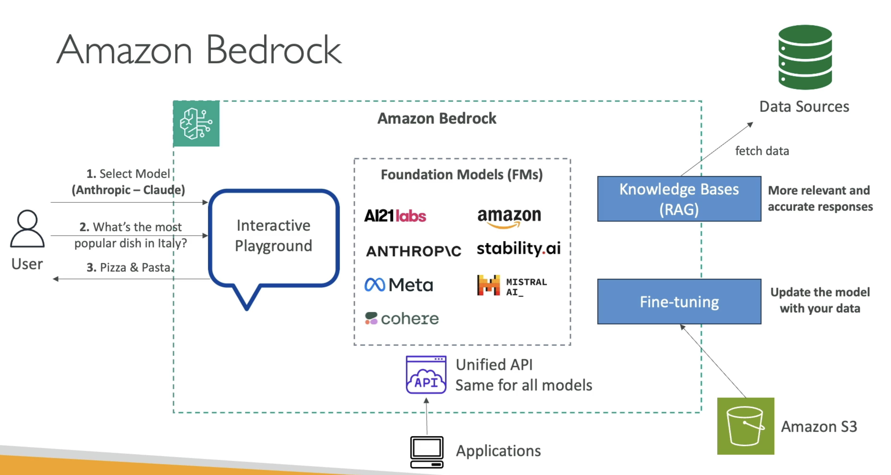

## Intro

## 1\. Overview

- **Amazon Bedrock** is a fully managed service on AWS designed for building generative AI applications.
- It provides a unified interface to interact with various foundation models without managing any underlying infrastructure.

---

## 2\. Key Features

- **Fully Managed Service:**
  - AWS handles all operational aspects, ensuring the service is always available.
- **Unified API:**
  - A standardized interface to interact with multiple generative AI models.
- **Pay-Per-Use Model:**
  - Cost-effective pricing based on actual usage.

## Amazon Bedrock - Foundation Models

## 3\. Foundation Models Integration

- **Diverse Model Providers:**
  - Bedrock supports models from multiple providers, including:
    - AI21 Labs
    - Cohere
    - Stability.ai
    - Amazon’s own models
    - Anthropic, Meta, Mitral AI, and more to come.
- **Exclusive Model Instance:**
  - When a model is used, Bedrock creates an exclusive copy within the user's AWS account.

---

## 4\. Data Security and Customization

- **Data Control:**
  - All training and fine-tuning data remains securely within your AWS account.
  - No data is sent back to the model providers.
- **Fine-Tuning Capability:**
  - Users can refine foundation models with their own data, ensuring the model is better tailored to specific needs.

---

## 5\. Interactive Features and Extended Functionality

- **Interactive Playground:**
  - Allows users to experiment with different models by issuing prompts (e.g., "What is the most popular dish in Italy?") and observing the responses.
- **Advanced Features:**
  - Supports techniques like Retrieval-Augmented Generation (RAG) and LLM agents to improve response accuracy and relevance.
- **Knowledge Base Integration:**
  - Enables connecting external data sources for more informed outputs.

---

## 6\. Architecture Insights

- **Service Diagram:**
  - At the center are the foundation models, with Amazon Bedrock orchestrating their use.
  - The unified API ensures that all applications communicate seamlessly with these models.
  - Advanced options like fine-tuning and external data integration enhance model performance for specific use cases.

---

## 7\. Summary Insights

- **Simplified AI Development:**
  - Amazon Bedrock removes the complexity of managing AI infrastructure, letting you focus on application development.
- **Customization and Control:**
  - Secure data handling and fine-tuning options ensure the service adapts to your unique requirements.
- **Scalability and Flexibility:**
  - With an expanding list of foundation models and advanced integration features, Bedrock supports a wide range of generative AI applications.
