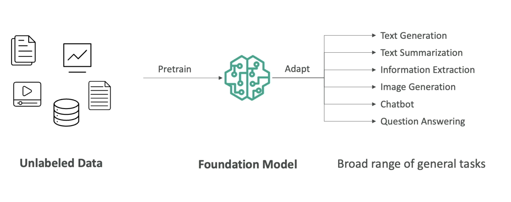
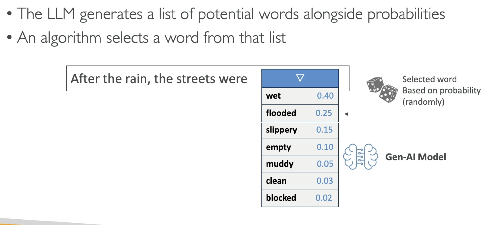
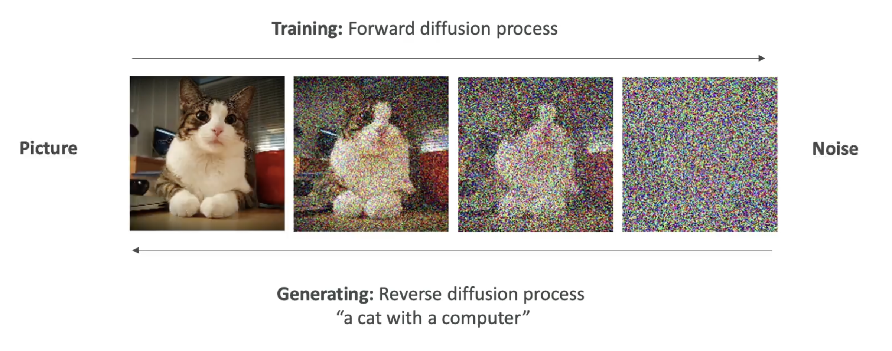

## Basic

**Generative AI (Gen AI):**

- A branch of AI focused on generating new data that mimics the patterns of its training data.
- Falls under the broader umbrellas of deep learning, machine learning, and ultimately artificial intelligence.

## Types of Data and Applications

- **Data Modalities:**
  - **Text:** For tasks like summarization, translation, content generation.
  - **Images:** For tasks such as creating artwork, transforming styles, and image-to-image generation.
  - **Audio, Code, Video, and More:** Expanding possibilities in multiple media.
- **Example Use Case:**
  - Combining diverse datasets (e.g., photos of dogs and hand-drawn cartoons) enables the model to synthesize unique outputs like a "cartoon dog."

## Foundation Model

## Foundation Models

- **Characteristics:**
  - Extremely broad and large-scale models.
  - Designed to perform a variety of tasks (e.g., text generation, summarization, image synthesis).
- **Resource Intensive:**
  - Training these models often requires massive datasets, high computational power, and significant financial investment (sometimes tens of millions of dollars).
- **Key Players:**
  - Developed mainly by large organizations such as OpenAI, Meta, Amazon, Google, and Anthropic.
- **Licensing:**
  - Some models are open source (e.g., Google BERT, projects by Meta), while others are commercially licensed (e.g., OpenAI’s GPT series).

## Large Language Model

## Large Language Models (LLMs)

- **Definition:**
  - A subset of foundation models specializing in natural language tasks.
- **Functionality:**
  - Generate coherent, human-like text based on input prompts.
  - Operate using billions of parameters learned from vast amounts of textual data.
- **Non-determinism:**
  - Due to probabilistic methods in word selection, the same prompt can lead to different outputs in different sessions.
  - The process involves computing probabilities for potential next words, making each output potentially unique.

### Not Deterministic Nature

What is the next word that can probably be in the sentence ?

## Probabilistic Generation Process

When we ask the Ai twice with the same prompt, we may not get the same answer because the
answer (sentence/text/word) is determined by statistical method and not deterministic methods.

- **Mechanism:**
  - Given an input (e.g., "After the rain, the streets were"), the model predicts a distribution of possible next words.
  - Each candidate word is assigned a probability (e.g., “flooded” might have a higher probability than “muddy”).
  - The final selection is made based on these probabilities, which introduces variability in outputs.

## Gen AI for Images

#### Generate image from text

#### Generate image from image

#### Generate Text from images

### Gen Ai for Images from Text

#### Diffusion Model: Stable Diffusion

## Generative AI in Image Processing

- **Text-to-Image and Beyond:**
  - Models can generate images from textual descriptions (e.g., “a blue sky with white clouds and the word ‘Hello’ in the sky”).
  - Capable of image-to-image transformation (e.g., converting a realistic image into a Japanese anime style).
- **Diffusion Models:**
  - **Forward Process:** Incrementally adds noise to an image until the original content is obscured.
  - **Reverse Process:** Begins with noise and gradually refines it into a coherent image guided by a textual prompt.
  - **Example:** Transforming an image of a cat by applying and then reversing noise to achieve a stylized output.
